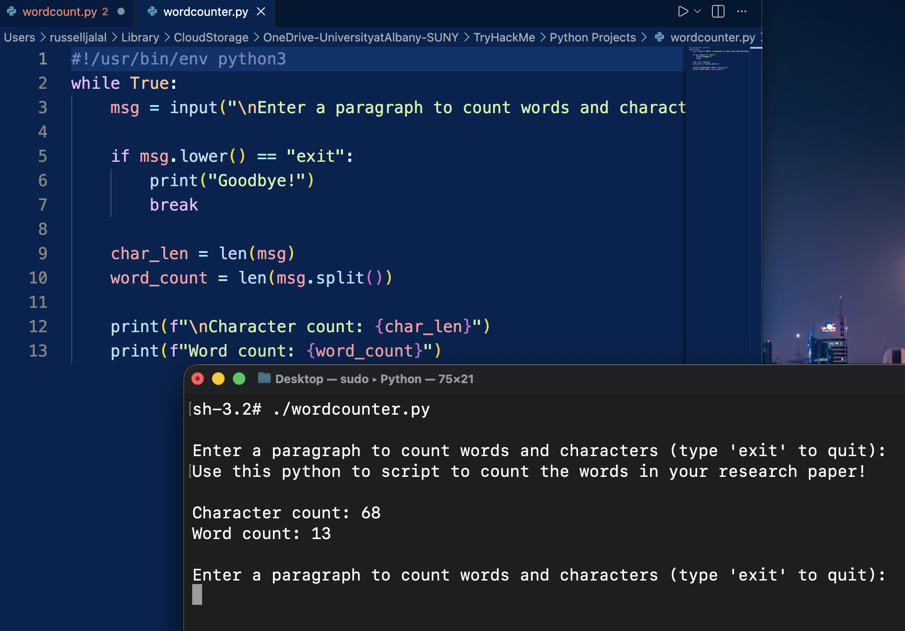

# Simple Python Word Counter
This python script can count the characters and the words in your any given paragraph.

## Why did I create this? 🤔
- I was writing a research paper 📄 and didn't have internet connection and I was not using Microsoft Word.
- I though to myself, wouldn't be this nice 
- Just have a simple python code and count the words in it without any internet connection.
- So I wrote it with my limited knowledge of Python and decided to publish it on GitHub! 😄
